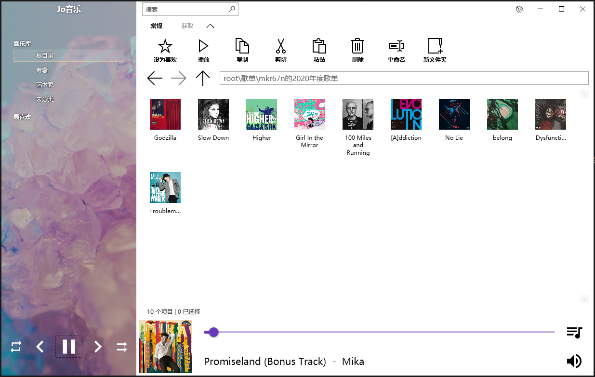
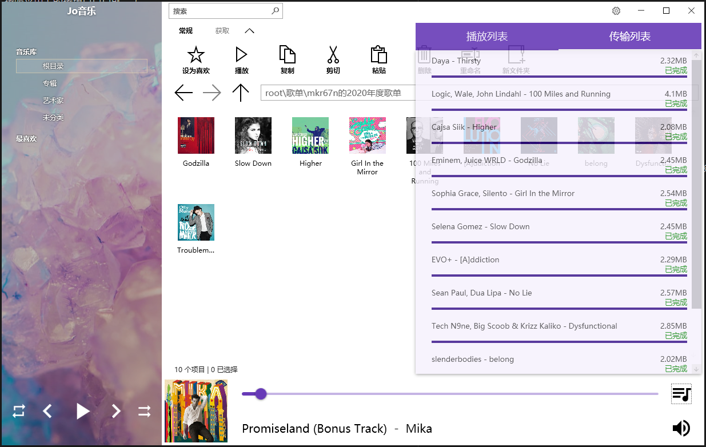

#音乐播放器 #项目 #JoMusic
# 简介
> - 这是我一年前的课设
> - 它写作歌曲播放器，读作wyy歌曲下载器（）
> - 它能勉强跑起来
> - 它是一坨屎山

# 功能
所以，它就是一个极其简陋的音乐播放器，它大概长这个样子：

它能够做的事情有：
 - 下载、导入、导出歌曲
 - 管理、查询库中的歌曲
 - 控制播放歌曲

它不能做的事情有：
 - 显示歌词（蚌）
 - 白嫖wyy

## 基本使用
说实话，这个东西也就勉强能冲的程度。我觉得你可以进行二次开发，但不是很建议你直接用它播放音乐，因为体验极差。

### 歌曲播放
按照菜单上的按钮点点点就完了

### 歌曲管理
关注两个菜单：
 - 顶部菜单
 - 左侧菜单
这两个地方能帮助你（稍微）快速找到歌曲

### 音乐下载
> 下载前需要在左上角的设置⚙页面填入自己的wyy会员账号cookies，否则大部分歌曲无法下载

 - 点击顶部菜单顶部的`获取`选单
 - 点击wyy
 - 输入歌曲或者歌单的分享链接，点击确定
 - 下载自动开始
     -点击右下角的`音符🎼按钮>传输列表`可以查看下载进度

# 日程
该软件作为第一个我真正意义上完成的软件，我并不想放弃。但是限于当初的知识水平和时间有限，走了很多弯路。
而如今我也没有时间处理这个项目，但如果有时间，我会继续这个软件的开发。
这里谈谈我日后（有时间后）的打算。

## 重构
> 首先需要对这坨屎进行消化

好在这坨屎本身是可拆卸的，我把这个解决方案分成了3个项目
1. MusicDB项目：用于存储和管理音乐文件（也就是文档管理系统）
2. Downloader项目：用于在互联网中分析各种协议和数据包，进行音乐下载和进度管理
3. MusicLibrary项目：用于制作播放器界面与呈现数据

### MusicDB
这是第一个需要重构的项目。
如前文所述，我这部分目前是使用关系型数据库实现的，这并不是好主意。

今天我和我的[专业顾问](https://openai.com/blog/chatgpt)深入交流后，得出了一个重要结论：
 - 我要用的应该是文档数据库`Document Database`（一种NoSQL）
它纯天然具有树状结构
 - 对于C#的implementation，我找到有如下推荐的客户端文档数据库
     - `LiteDB`：为.Net而生（拟定）
     - `Couchbase Lite`：可用在.Net

> 如果重构，我会用LiteDB写文档管理系统底层逻辑

### MusicLibrary
这是第二个需要重构的项目。
我受够WPF了。我不是指它不强大，而生其生态、学习成本和技术热度实在很难让我继续下去。

额。.Net在做这方面也是很迷惑，他们似乎自己也没搞明白到底哪个最靠谱= =
但说实话，虽然WPF给我的体验不太好，我也不确定其它框架就比WPF要强。

> 那我还是静观其变吧

### Downloader
这个项目目前没什么问题，但有提升的空间。也许可以使用统一的接口做更强大的下载功能。

## 功能
处理或加入的优先级（越低越优先）

### 传输模块
| 名称 |  | 备注 |
|--|--|--|
| 查看任务进度 | 1 | 基本实现，但不完善 |
| 只导入URI | 1 | 不下载保存，在线听 |
| 从其他音乐平台导入 | 2 |
| 下载记录 | 3 | 好像没必要 |
| 完善异步 | 3 |  |

### 库模块
| 名称 |  | 备注 |
|--|--|--|
| 彻底重构 | 1 |  |
| 面包屑导航 | 2 |  |
| 高级搜索 | 2 |  |
| 检测用户直接对音乐文件的更改 | 2 | 基本实现，但不完善 |
| tag系统 | 3 | 对音乐库来讲意义不大 |

### 音乐播放器模块
| 名称 |  | 备注 |
|--|--|--|
| 重构界面实现 | 1 |  |
| 改善播放控制 | 1 |  |
| 改善播放列表 | 1 |  |
| 歌词 | 2 |  |

# 使用建议
 - 不建议你在不二次开发的情况下直接使用这个软件。
 - 调试和发布时数据库连接字符串不同，需要修改